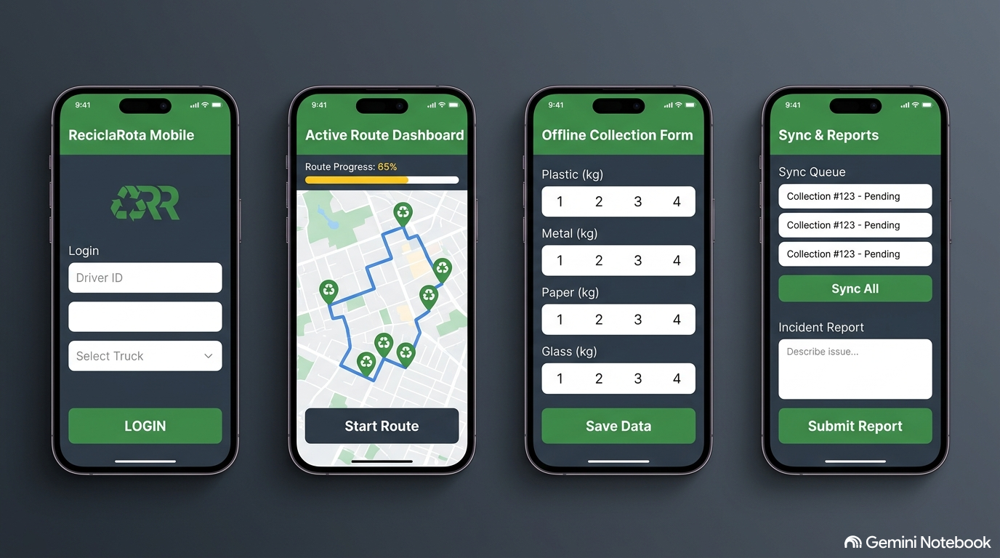
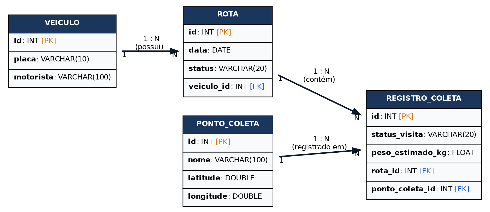

# ReciclaRota Mobile

O **ReciclaRota Mobile** é um aplicativo mobile desenvolvido para motoristas e coletores de veículos de coleta seletiva urbana. Ele funciona de forma integrada a um painel web municipal de monitoramento, permitindo que os operadores visualizem rotas otimizadas, registrem a coleta de resíduos recicláveis em tempo real e reportem problemas ou ocorrências nas vias urbanas.

O aplicativo adota uma abordagem **Offline-First**. Como a coleta ocorre em trânsito e muitas vezes em zonas com conectividade móvel instável ou inexistente, todo o roteamento e registro de coletas podem ser feitos de forma local. Os dados são salvos em uma fila de sincronização no dispositivo e enviados automaticamente ao servidor municipal assim que a conexão com a internet for restabelecida.

---

## Sobre o App

O aplicativo é desenvolvido com React Native e Expo, utilizando TypeScript para tipagem estática e segurança do código. A arquitetura de componentes visuais segue estritamente a metodologia do **Atomic Design** (separação modular em Átomos, Moléculas, Organismos e Templates) para promover o reaproveitamento máximo de código.

### Funcionalidades Básicas (Checklist de Requisitos)
- [ ] **Autenticação de Operadores:** Login integrado e persistente para identificar o motorista e o veículo associado.
- [x] **Visualização de Rotas do Dia:** Exibição detalhada dos pontos ecológicos de coleta ordenados para otimização do trajeto. *(Implementado com o Organismo `RouteList` e a Molécula `PointCard`!)*
- [x] **Registro Offline de Coletas:** Cadastro local da quantidade e tipo de resíduo coletado (peso em kg por categoria: plástico, metal, papel, vidro) sem dependência de rede. *(Implementado via alerta de pesagem simulada salvando dados no estado!)*
- [/] **Fila de Sincronização Assíncrona:** Gerenciamento de estado global com Zustand persistido no AsyncStorage para envio automático em segundo plano. *(Fila local `pendingSyncQueue` e persistência física com AsyncStorage já totalmente configuradas!)*
- [ ] **Registro de Ocorrências:** Envio de alertas rápidos sobre lixeiras depredadas, vias obstruídas ou ausência de material reciclável no ponto.

### Funcionalidades Adicionais (Trabalhos Futuros)
- [ ] **Navegação GPS Ativa:** Integração com mapas locais (Google Maps/Apple Maps) para navegação dinâmica no trânsito.
- [ ] **Agendamento Sob Demanda:** Recebimento de ordens de serviço geradas por moradores locais em tempo real.
- [ ] **Métricas de Impacto Ambiental:** Painel de estatísticas mostrando os quilos totais coletados e o equivalente de CO2 poupado pelo veículo.

---

## Protótipos de Tela

A interface foi projetada especificamente para uso em trânsito, focando em botões amplos, alto contraste e facilidade de leitura para os motoristas. O fluxo de navegação completo foi prototipado no Figma.

- **Link público para o Figma:** [Acesse o Protótipo do ReciclaRota Mobile no Figma](https://www.figma.com/design/yxRpxcZeoEDDvUYFYYDNit/mapa-de-telas?node-id=0-1&t=n6UwnGPE669rCgJe-1)

> 💡 **Fluxo de Navegação:** O protótipo demonstra o percurso completo do operador desde a autenticação, seleção de rota, visualização do mapa interativo com pontos de coleta e fluxo de preenchimento offline do formulário de coletas.

### Mapa de Telas
Caso queira conferir a exportação estática de todas as telas unificadas em um fluxo:



### Mapa de Rotas

- **Link público para o Figma:** [Acesse o Mapa de Rotas no Figma](https://www.figma.com/board/VVBXCsn4tZnIXHPiwoun8Y/Sem-t%C3%ADtulo?node-id=3-2&t=BUTX615d14olNLJZ-1)
---

## Modelagem do Banco de Dados

A persistência de dados do **ReciclaRota Mobile** é estruturada de forma híbrida para garantir operação ininterrupta (Offline-first) conectando-se assincronamente a uma API centralizada.

### 1. Implementação Local (Dispositivo Móvel)
- **Gerenciador de Estado:** **Zustand** com middleware `persist`.
- **Armazenamento Físico:** `@react-native-async-storage/async-storage` para persistir as rotas e fila de sincronização.
- **Estruturas Otimizadas:** Uso de Mapas e Conjuntos (Map/Set) no Zustand para acesso indexado rápido aos pontos de rota, utilizando serializadores customizados para salvamento JSON no armazenamento do celular.

#### Schema JSON do Estado Local Implementado:
```json
{
  "state": {
    "activeRoute": {
      "id": "rota-seletiva-centro-102",
      "date": "2026-09-07",
      "vehiclePlate": "ABC-1234",
      "points": [
        {
          "id": "1",
          "name": "Ecoponto Rápido - Praça Central",
          "latitude": -25.39,
          "longitude": -51.46,
          "status": "COMPLETED",
          "weightKg": 45
        },
        {
          "id": "2",
          "name": "Condomínio Residencial Green",
          "latitude": -25.4,
          "longitude": -51.47,
          "status": "PENDING",
          "weightKg": 120
        }
      ]
    },
    "pendingSyncQueue": [
      {
        "id": "1",
        "name": "Ecoponto Rápido - Praça Central",
        "status": "COMPLETED",
        "weightKg": 45
      }
    ]
  },
  "version": 0
}
```

### 2. Implementação Remota (Servidor Central)
- **Backend:** API REST desenvolvida em Laravel 10.
- **Banco de Dados:** Banco relacional PostgreSQL hospedado na nuvem municipal.

#### Diagrama Entidade-Relacionamento (Parcial consumida pelo Mobile):
```text
+-------------------+         1 : N         +-------------------+
|      VEICULO      | --------------------- |       ROTA        |
+-------------------+                       +-------------------+
| id (PK) - INT     |                       | id (PK) - INT     |
| placa - VARCHAR   |                       | data - DATE       |
| motorista -VARCHAR|                       | status - VARCHAR  |
+-------------------+                       +-------------------+
                                                      | 1
+-------------------+                                 |
|   PONTO_COLETA    | 1                               |
+-------------------+ \                               |
| id (PK) - INT     |  \                              |
| nome - VARCHAR    |   \ N                           | N
| latitude - DOUBLE |    \ +-------------------------+
| longitude - DOUBLE|      |     REGISTRO_COLETA     |
+-------------------+      +-------------------------+
                           | id (PK) - INT           |
                           | status_visita - VARCHAR |
                           | peso_estimado_kg-FLOAT  |
                           | rota_id (FK)            |
                           | ponto_coleta_id (FK)    |
                           +-------------------------+
```




---

## Planejamento de Sprints

O cronograma do projeto está organizado em 5 Sprints quinzenais ao longo de 10 semanas, definindo metas claras e realistas de desenvolvimento:

### Cronograma de Desenvolvimento (Road-map)

| Sprint | Duração Prevista | Funcionalidades / Entregas Focadas | Status |
| :--- | :--- | :--- | :--- |
| **Sprint 1** | Semanas 1 e 2 | Setup inicial do Expo + TypeScript; Criação da estrutura de diretórios do Atomic Design; Desenvolvimento dos primeiros Átomos (StatusBadge, Buttons). | **100% Concluído** ✅ |
| **Sprint 2** | Semanas 3 e 4 | Criação das telas de Login e Dashboard de rotas; Navegação tipada instalada; Estado global de autenticação com Zustand. | **Em progresso** 🚀 |
| **Sprint 3** | Semanas 5 e 6 | Integração com Mapas nativos; Criação do Card de Ponto de Coleta (Molécula); Persistência offline de dados de rota via AsyncStorage. | **Estrutura de Molécula/Organismo e Persistência criadas** 🌟 |
| **Sprint 4** | Semanas 7 e 8 | Criação do formulário de coleta; Implementação da fila de sincronização offline e verificação ativa de rede (NetInfo). | **Fila local e pesagem simulada concluídas** |
| **Sprint 5** | Semanas 9 e 10 | Conexão definitiva com a API Laravel remota; Testes completos em simuladores; Polimento de interface e geração de Build de produção (APK). | Planejado |

### Metas por Checkpoints da Disciplina

- **Checkpoint 1 (Sprints 1 e 2):** Estrutura e padrões visuais funcionais, componentes de interface bem segmentados com Atomic Design e navegação fluida de login.
- **Checkpoint 2 (Sprints 3 e 4):** Persistência offline-first em pleno funcionamento; capacidade de coletar e navegar sem conexão de dados ativa.
- **Checkpoint 3 (Sprint 5):** Sincronização final de dados com o backend centralizado e fechamento da build de produção do app móvel.
